# Exno:1
Data Cleaning Process

# AIM
To read the given data and perform data cleaning and save the cleaned data to a file.

# Explanation
Data cleaning is the process of preparing data for analysis by removing or modifying data that is incorrect ,incompleted , irrelevant , duplicated or improperly formatted. Data cleaning is not simply about erasing data ,but rather finding a way to maximize datasets accuracy without necessarily deleting the information.

# Algorithm
STEP 1: Read the given Data

STEP 2: Get the information about the data

STEP 3: Remove the null values from the data

STEP 4: Save the Clean data to the file

STEP 5: Remove outliers using IQR

STEP 6: Use zscore of to remove outliers

# Coding and Output
```
import pandas as pd
df=pd.read_csv("/content/SAMPLEIDS.csv")
df
```
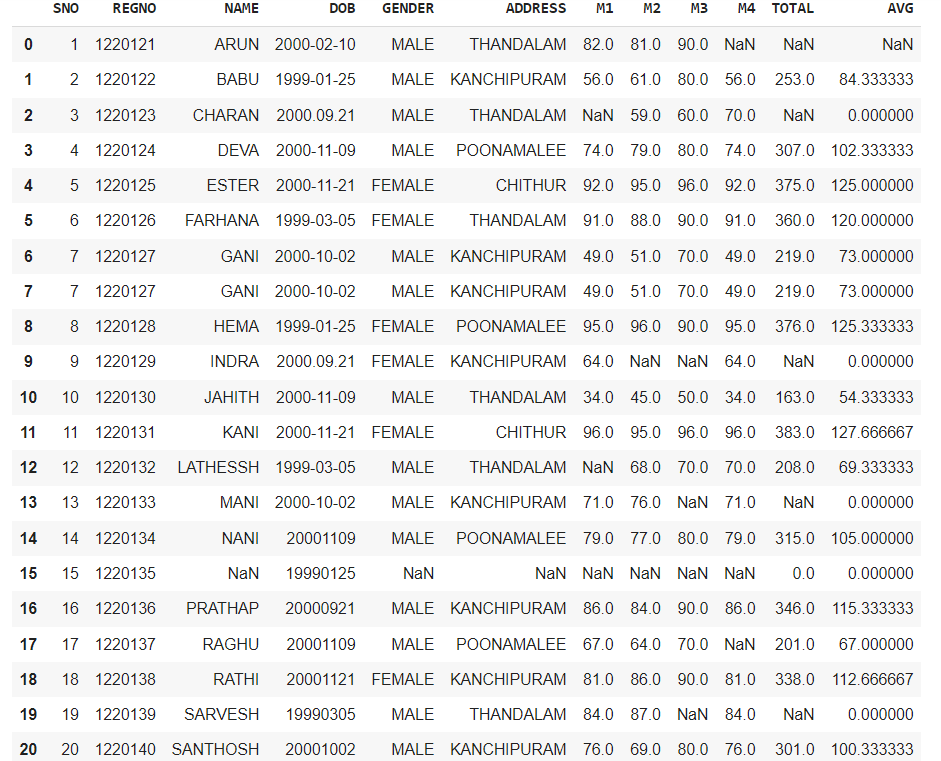

```
df.head()
```
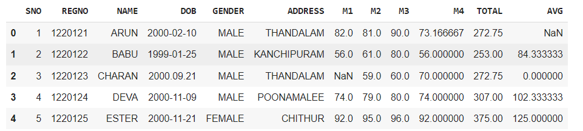
```
df.tail()
```
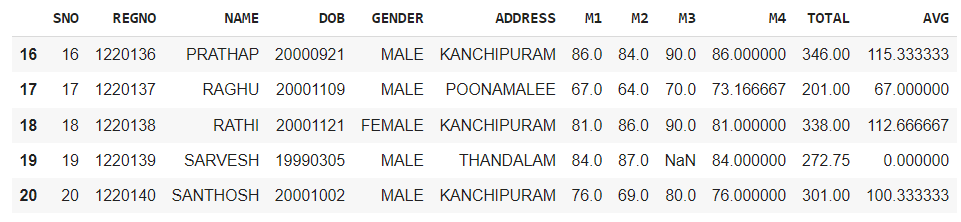
```
df.describe()
```
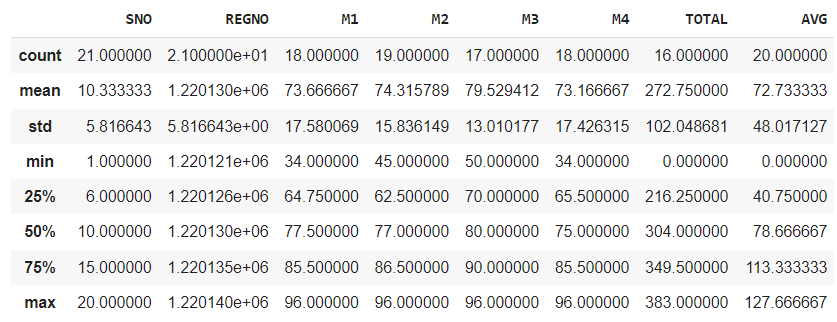
```
df.info()
```
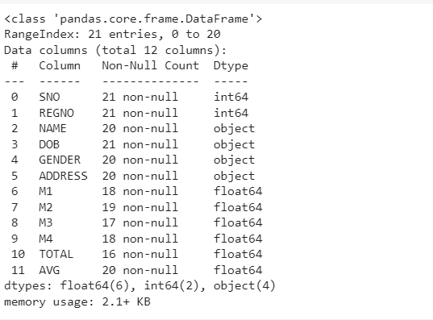
```
df.shape()
```
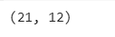
```
df.isnull().sum()
```
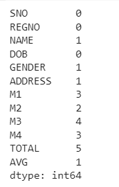
```
df.nunique()
```
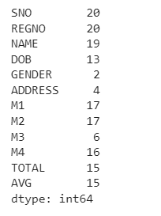
```
df.['GENDER'].value_counts()
```
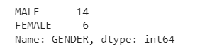
```
mn=df.TOTAL.mean()
mn
```
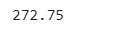
```
df.TOTAL.fillna(mn,inplace=True)
df
```
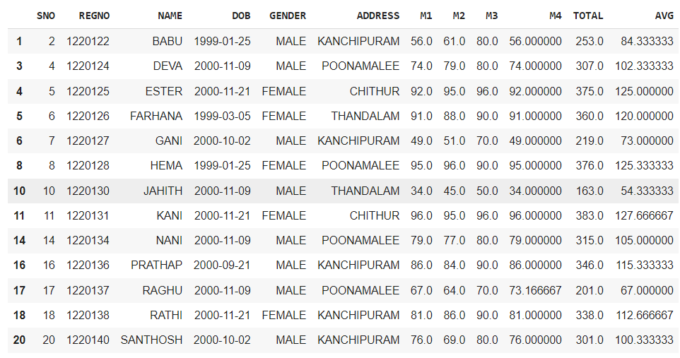
```
x=df.M4.mean()
x
```
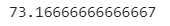
```
df.M4.fillna(x,inplace=True)
df
```
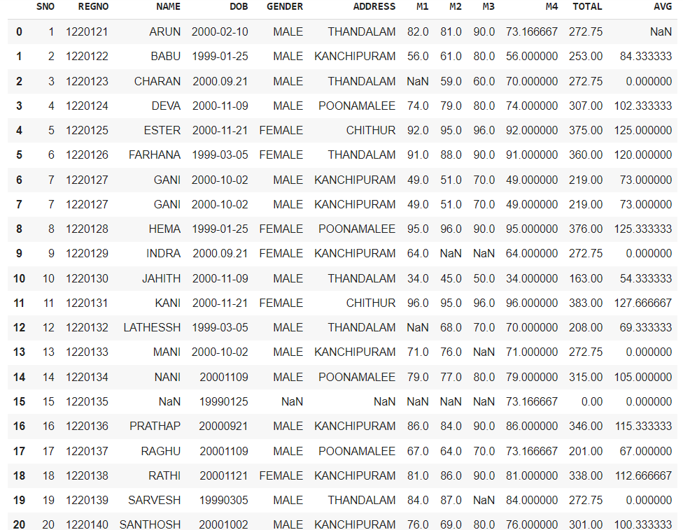
```
import pandas as pd
import seaborn as sns
age=[1,3,28,27,25,92,30,39,40,50,26,24,29,94]
af=pd.DataFrame(age)
af
```
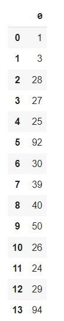
```
sns.boxplot(data=af)
```
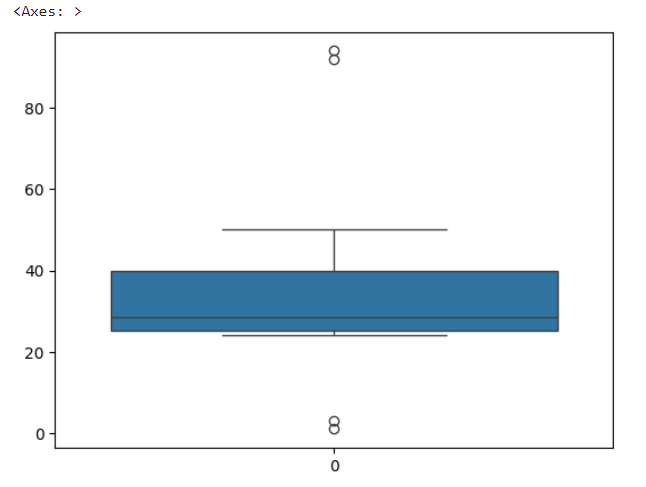
```
sns.scatterplot(data=df)
```
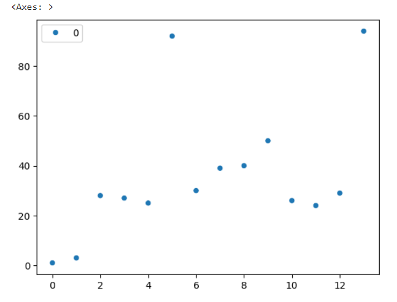
```
q1=af.quantile(0.25)
q2=af.quantile(0.5)
q3=af.quantile(0.75)
iqr=q3-q1
iqr
```
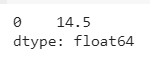
```
print("Q1:",Q1)
print("Q3:",Q3)
print("IQR:",IQR)
print("Lower bound:",lower_bound)
print("Upper bound:",upper_bound)
print("Outliers:",outliers)
```
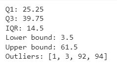
```
af=af[((af>=lower_bound)&(af<=upper_bound))]
af
```
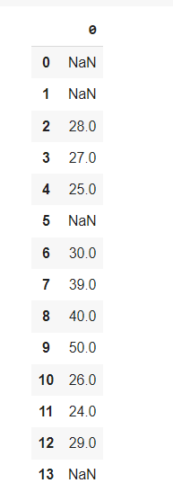
```
af.dropna()
```
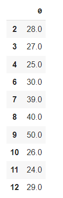
```
sns.boxplot(data=af)
```
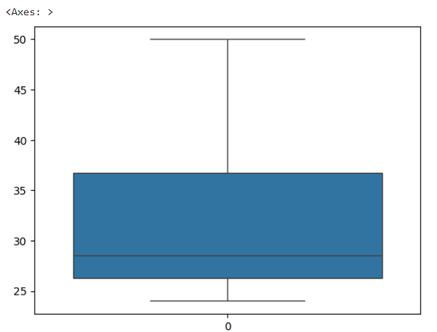
```
sns.scatterplot(data=af)
```

```
data={'weight':[12, 15, 18, 21, 24, 27, 30, 33, 36, 39, 42, 45, 48, 51, 54, 57, 60, 63, 66, 69,202, 72, 75, 78, 81, 84,232, 87, 90, 93, 96, 99, 258]}
df=pd.DataFrame(data)
df
```
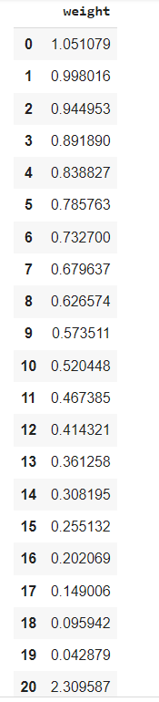
```
z=np.abs(stats.zscore(df))
z
```
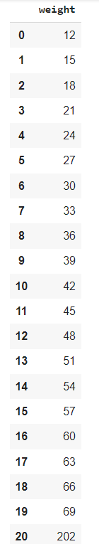
# Result
Thus the given program executed successfully.